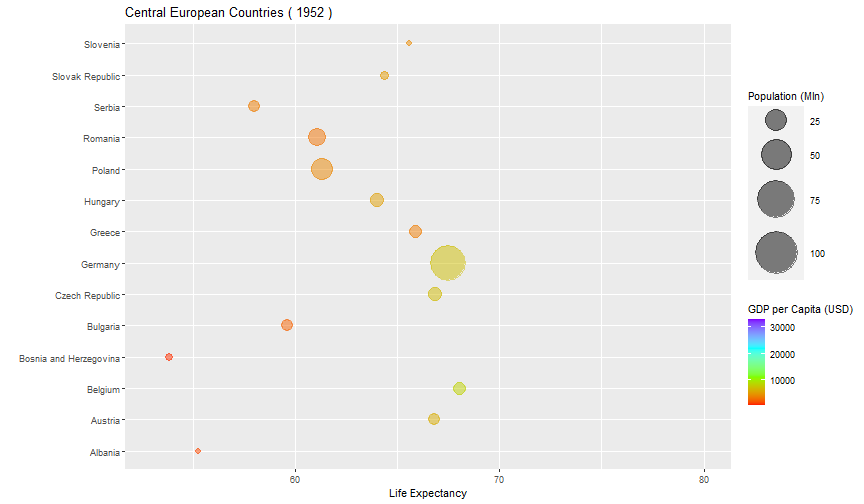
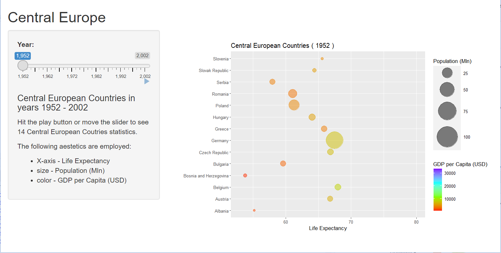

Central European Countries (1952-2002)
========================================================
author: Piotr Tadeusz Zalewski
date: 09/11/2021
autosize: true

Gapminder data
========================================================

Excerpt of the Gapminder data on life expectancy, GDP per capita, and population by country <http://www.gapminder.org/data/>.

- **country** - *factor with 142 levels*
- **continent** - *factor with 5 levels*
- **year** - *anges from 1952 to 2007 in increments of 5 years*
- **lifeExp** - *life expectancy at birth, in years*
- **pop** - *population*
- **gdpPercap** - *GDP per capita (US$, inflation-adjusted)*

Data Subset
========================================================


```r
# Countries of interest
coi <- c("Albania",
         "Austria",
         "Belgium",
         "Bosnia and Herzegovina",
         "Bulgaria",
         "Czech Republic",
         "Germany",
         "Greece",
         "Holland",
         "Hungary",
         "Poland",
         "Serbia",
         "Romania",
         "Slovak Republic",
         "Slovenia")
```

Data Plot
========================================================



Shiny App
========================================================
[Central Europe Shiny App](https://piotrtadeuszzalewski.shinyapps.io/centraleurope/) 



